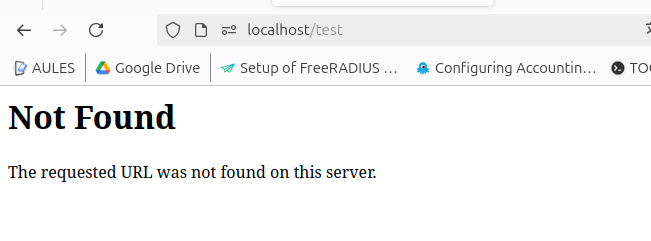
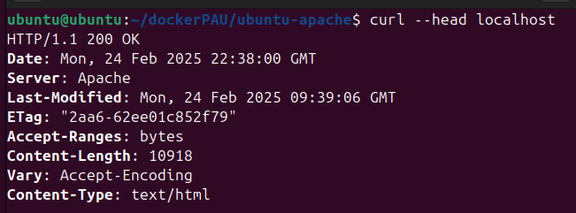

# RA3_1_1 CSP

### Indice

* [Explicación](#Explicación): Explicación
* [Desarrollo](#Ejemplos-de-ejecución): Desarrollo
* [Navegación](#Navegación): Navegación
  
# Explicación

En este primer punto tenemos como objetivo realizar una configuración de apache segura y establecer una politica segura del contenido.
Esto se consigue realizando una instalación actualizada de Apache2 y añadiendo las modificaciones necesarias al archivo de configuración.  
[Recursos](./sources)  
[Dockerfile](./sources/dockerfile)  

## Resultados
Tras crear la imagen tenemos una versión de Apache2 que no permite el indexado automatico del contenido de los directorios.
  
Y que no expone información adicional en las cabeceras de la Web.
  
  
#### Advertencia
Algunas de las configuraciones requeridas en la práctica se encuentran configuradas por defecto en las nuevas versiones de apache2.

# Ejemplos de ejecución

## Usando dockerfile
```
curl -O https://raw.githubusercontent.com/migvivcam/PPS-10197785/refs/heads/main/RA3/RA3_1/RA3_1_1/sources/dockerfile
docker build -t apache2-migvivcam .
docker run -p 80:80 -p 443:443 -d --name a2-CSP apache2-migvivcam
docker exec -it a2-CSP bash
```
## Limpiar el sistema
```
docker stop a2-CSP
docker container rm a2-CSP
docker image rm apache2-migvivcam
```

#### Navegación
[<- Atrás](../)  -  [Arriba](#RA3_1_1-CSP)  -  [Siguiente ->](../RA3_1_2)