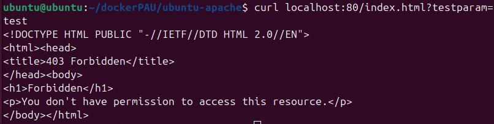
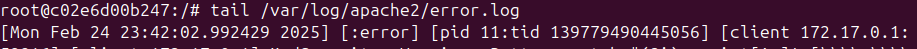
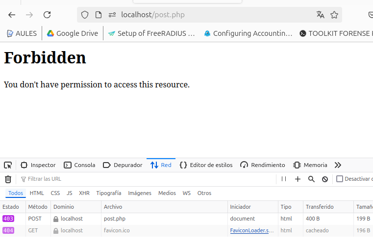

# RA3_1_2 WAF y OWASP

### Indice

* [Explicación](#Explicación): Explicación
* [Desarrollo](#Ejemplos-de-ejecución): Desarrollo
* [Navegación](#Navegación): Navegación
  
# Explicación

En este segundo punto se implementan las reglas de seguridad de OWASP, las cuales incluyen por defecto una Web Application Firewall.  
En versiones recientes del modulo modsecurity2 estas reglas vienen establecidas por defecto y el WAF implementado sin requerir acciones adicionales.
Por este motivo, en el dockerfile habilitamos las reglas por defecto, y las acivamos en el sitio Web.  
[Recursos](./sources)  
[Dockerfile](./sources/dockerfile)  

## Resultados
Tras crear la imagen con dockerfile tenemos una instalación de apache con las reglas basicas de OWASP, y al hacer un intento de inyección de codigo recibimos una advertencia.
  
Este intento de acceso queda registrado en los logs del sistema.

Y por ultimo si intentamos hacer XSS en una página de ejemplo podemos ver que el servidor rechaza la conexión.

  
#### Advertencia
Algunas de las configuraciones requeridas en la práctica se encuentran configuradas por defecto en las nuevas versiones de apache2.

# Ejemplos de ejecución

## Usando docker run
```
docker run -p 80:80 -p 443:443 -d --name a2-WAF migvivcam/apache2:pr2
docker exec -it a2-WAF bash
```
## Limpiar el sistema
```
docker stop a2-WAF
docker container rm a2-WAF
docker image rm migvivcam/apache2:pr2
```

#### Navegación
[<- Atrás](../)  -  [Arriba](#RA3_1_2-WAF-y-OWASP)  -  [Siguiente ->](../RA3_1_3)