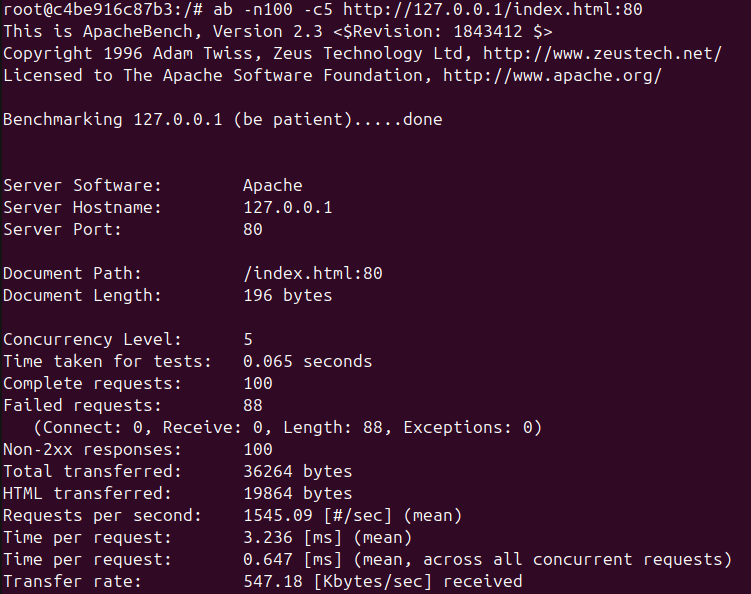

# RA3_1_3 DDOS

### Indice

* [Explicación](#Explicación): Explicación
* [Desarrollo](#Ejemplos-de-ejecución): Desarrollo
* [Navegación](#Navegación): Navegación
  
# Explicación

Para evitar ataques de DDOS apache proporciona un modulo llamado evasive, el cual nos permite configurar unos umbrales de acceso por ip, el archivo de configuración se encuentra en la carpeta sources.
En el dockerfile se activa el modulo y se incorpora el archivo de configuración del mismo.  
[Recursos](./sources)  
[Dockerfile](./sources/dockerfile)  

## Resultados

Tras la creación de la imagen tenemos una version de apache que cuenta con una protección frente ataques DDOS ademas de CSP y reglas OWASP.  
Para probar el funcionamiento del modulo se usa ab lanzando 100 accesos a la página web.  
  
  
#### Advertencia
Algunas de las configuraciones requeridas en la práctica se encuentran configuradas por defecto en las nuevas versiones de apache2.

# Ejemplos de ejecución

## Usando docker run
```
docker run -p 80:80 -p 443:443 -d --name a2-DDOS migvivcam/apache2:pr3
docker exec -it a2-DDOS bash
```
## Limpiar el sistema
```
docker stop a2-DDOS
docker container rm a2-DDOS
docker image rm migvivcam/apache2:pr3
```

#### Navegación
[<- Atrás](../)  -  [Arriba](#RA3_1_3-DDOS)  -  [Siguiente ->](../RA3_1_4)