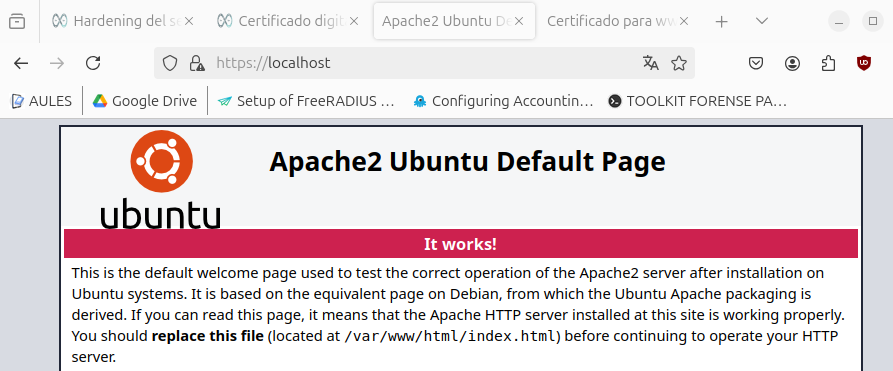
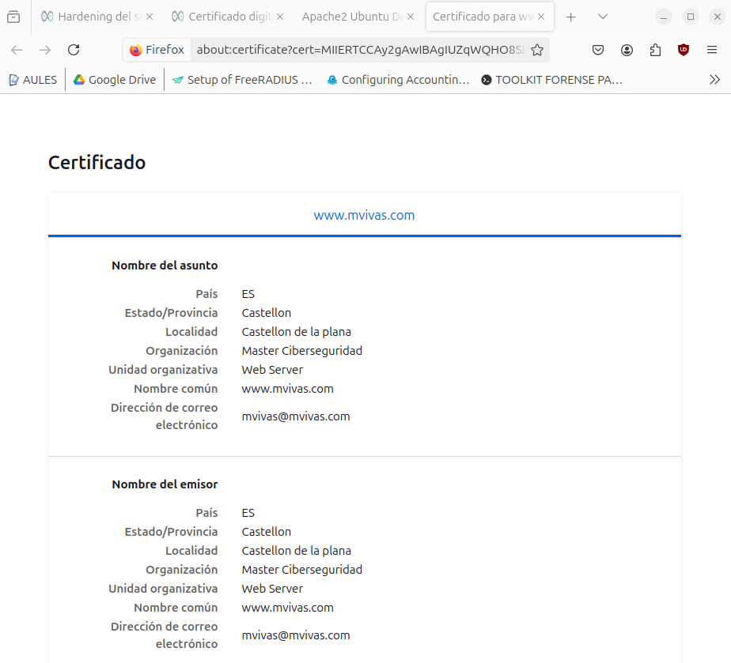

# RA3_1_3 SSL

### Indice

* [Explicación](#Explicación): Explicación
* [Desarrollo](#Ejemplos-de-ejecución): Desarrollo
* [Navegación](#Navegación): Navegación
  
# Explicación

Para poder usar certificados en la página web se usa el modulo SSL y se habilita el sitio Web default-SSL, en el cual configuramos que use las reglas de OWASP para evitas XSS.
Los certificados se crean en la máquina anfitrion y se copian en la carpeta sources junto al dockerfile, el cual los incorporará a la imagen de docker automaticamente.  
[Recursos](./sources)  
[Dockerfile](./sources/dockerfile)  

## Resultados

Una vez se crea la imagen o se descarga de dockerhub, tenemos una instalación de apache que usa certificados autofirmados SSL.  
  
Y si accedemos a la información de los certificados para ver su información podemos ver los detalles.  
  
  
#### Advertencia
Algunas de las configuraciones requeridas en la práctica se encuentran configuradas por defecto en las nuevas versiones de apache2.

# Ejemplos de ejecución

## Usando docker run
```
docker run -p 80:80 -p 443:443 -d --name a2-SSL migvivcam/apache2:pr4
docker exec -it a2-SSL bash
```
## Limpiar el sistema
```
docker stop a2-SSL
docker container rm a2-SSL
docker image rm migvivcam/apache2:pr4
```

#### Navegación
[<- Atrás](../)  -  [Arriba](#RA3_1_4-SSL)  -  [Siguiente ->](../RA3_1_5)