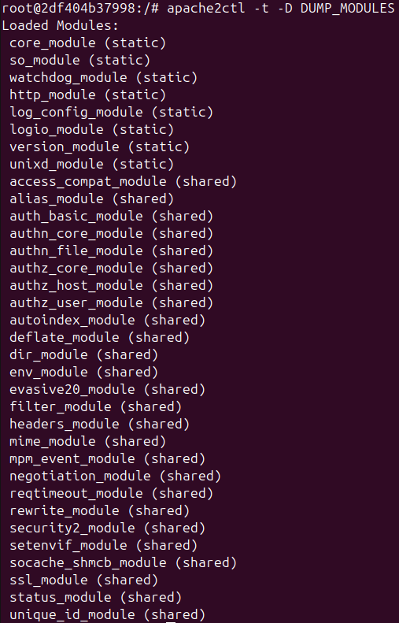
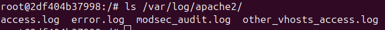
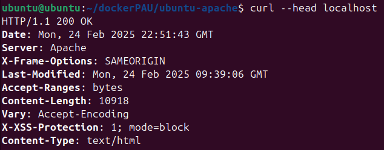

# RA3_1_3 SSL

### Indice

* [Explicación](#Explicación): Explicación
* [Desarrollo](#Ejemplos-de-ejecución): Desarrollo
* [Navegación](#Navegación): Navegación
  
# Explicación

En este ultimo punto de la práctica se realizan securizaciones adicionales del servicio Apache2.  
Entre ellas, se deshabilitan modulos que exponen información sensible en los header de la web, se configura SSL para que solo permita protocolos seguros actualizados, se modifica la configuración de apache para que haga un registro de logging y que solo acepte peticiones GET POST y HEAD.  
Además se habilitan los modulos rewrite y headers para deshabilitar el protocolo HTTP 1.0 y securizar cookies, evitar ataques de clickjacking y X-XSS.  
[Recursos](./sources)  
[Dockerfile](./sources/dockerfile)  

## Resultados

Para comprobar que estos cambios están en producción podemos hacer un dump de los modulos de apache.
  
Podemos listar los logs de apache2.
  
Y comprobar las cabeceras de la página web.
  
  
#### Advertencia
Algunas de las configuraciones requeridas en la práctica se encuentran configuradas por defecto en las nuevas versiones de apache2.

# Ejemplos de ejecución

## Usando docker run
```
docker run -p 80:80 -p 443:443 -d --name a2-HAR migvivcam/apache2:pr5
docker exec -it a2-HAR bash
```
## Limpiar el sistema
```
docker stop a2-HAR
docker container rm a2-HAR
docker image rm migvivcam/apache2:pr5
```

#### Navegación
[<- Atrás](../)  -  [Arriba](#RA3_1_4-SSL)  -  [Inicio](../../../)