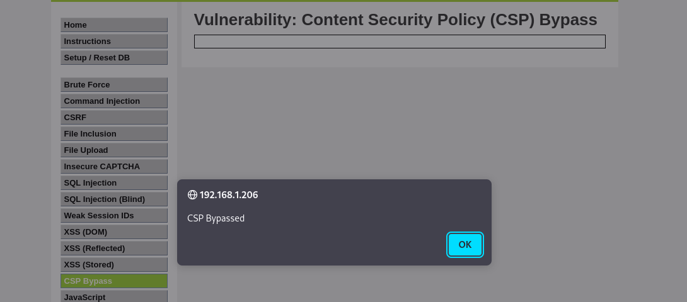
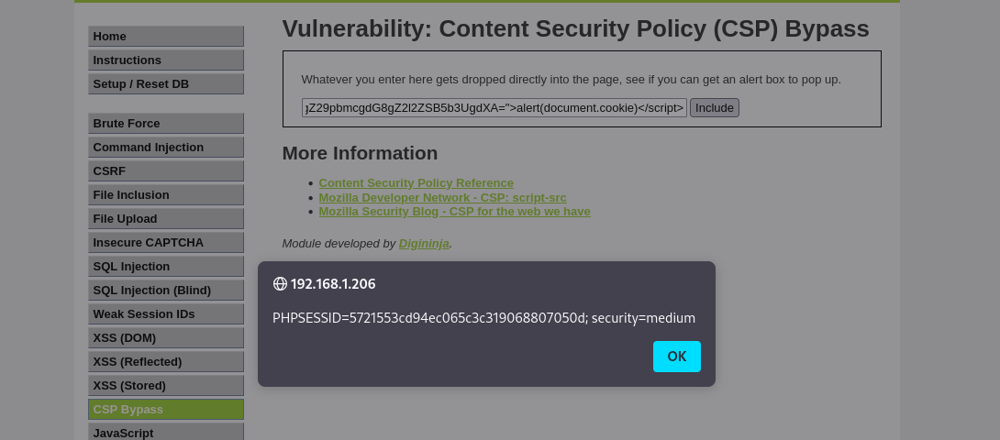

**LOW**

El scr no está establecido correctamente ene le servidor Web por lo que podemos utilizar codigo hosteado en otros servidores para su ejecución en la aplicación vulnerable.

**MEDIUM**

En el caso del nivel medium se utiliza un nonce para establecer los recursos que la página puede cargar, pero utiliza un valor estatico, por lo que se añade al payload para hacer el bypass.

### Nivel LOW

### Nivel Medio

