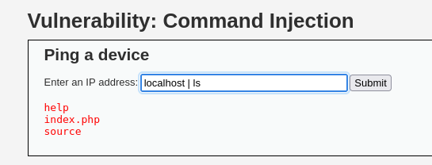

La pagina permite la ejecución del comando ping.

En el cuado de texto para introducir la ip objetibo se puede añadir una tuberia para ejecutar comandos adicionales.

### Nivel LOW - Medio

### Nivel Alto

