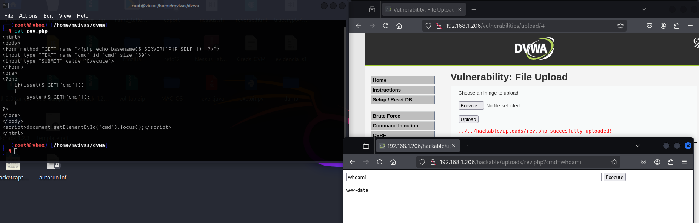
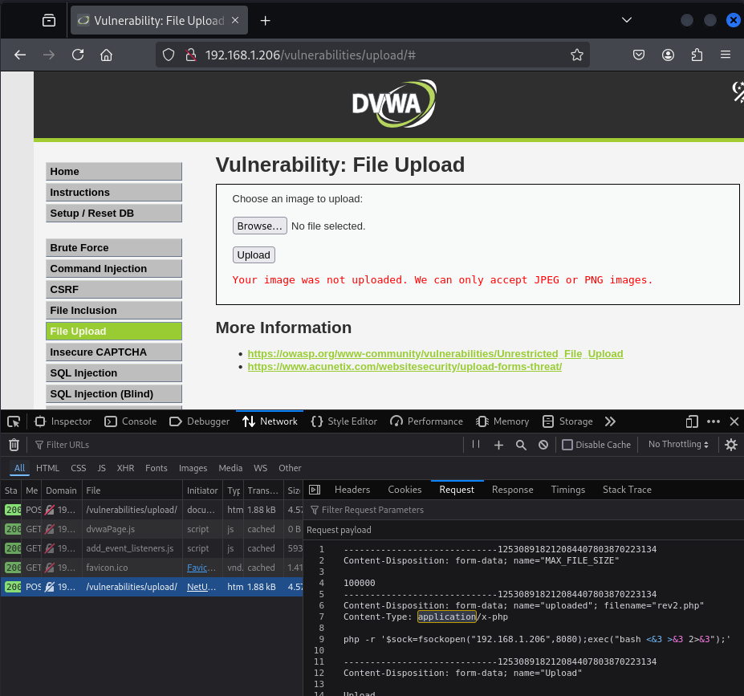

**LOW**

Se permite subri archivos PHP, por lo que se crea un archivo que me permite ejecutar comandos en el servidor web.

**MEDIUM**

Se realiza un control del tipo de archivo, para hacer el bypass se modifica la petición para que el servidor crea que se está enviando un archivo correcto.

### Nivel LOW

### Nivel Medio

