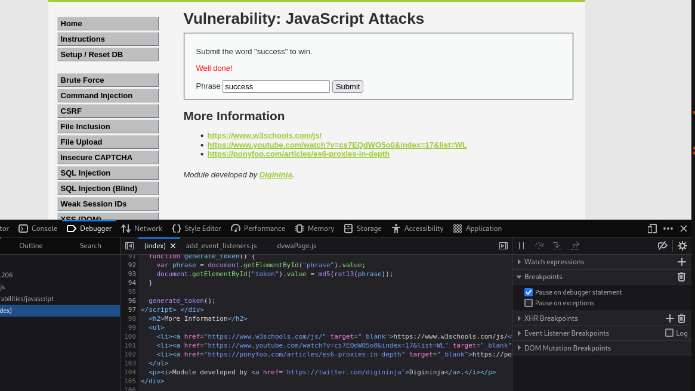
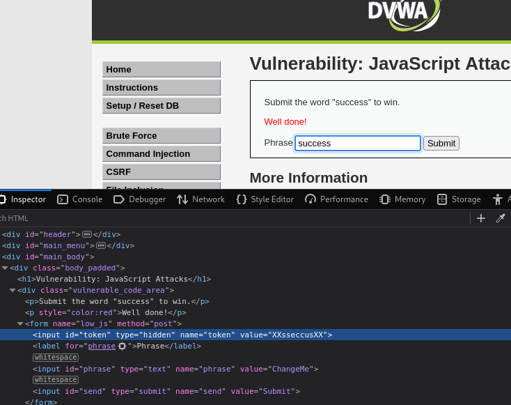

**LOW**

Existe un campo oculto llamado token con un valor, inspeccionando el codigo javascript podemos ver que realiza un rot13 del campo introducido para luego realizar un md5 y compararlo con el token, para superarlo se cambia el valor del token y se escribe success.

**MEDIUM**

El token en el nivel medium es una concatenación de caracteres y la cadena invertida, el codigo javascript esta ligeramente ofuscado, pero se sigue el mismo procedimiento, se cambia el valor del token por uno valido y se escribe success en el campo.

### Nivel LOW

### Nivel Medio

