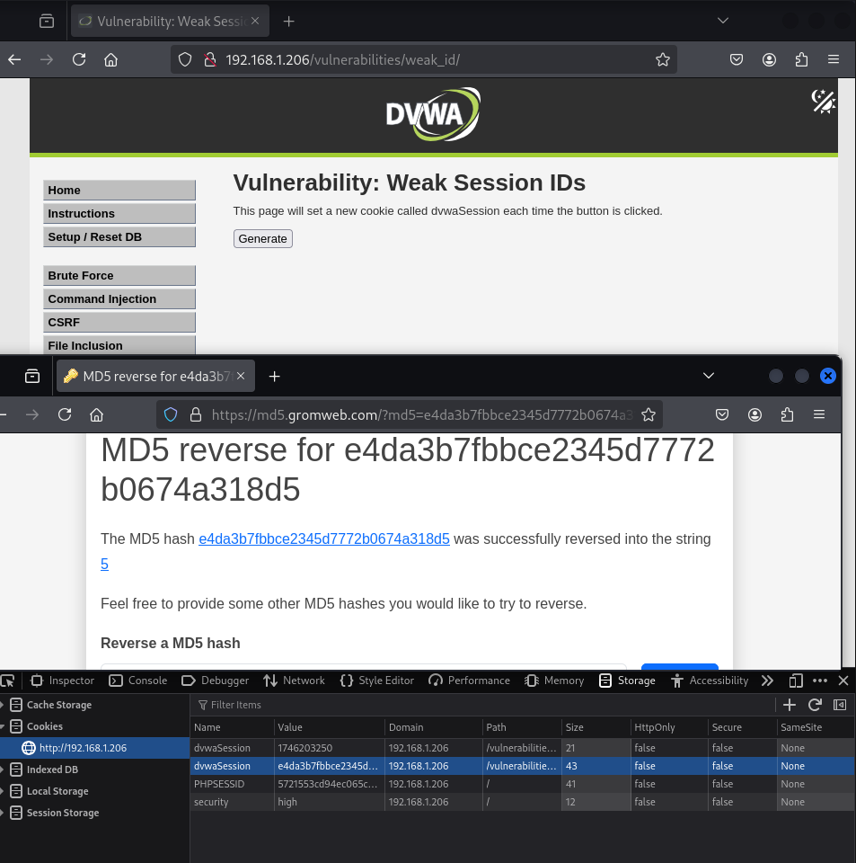

**LOW**

Se utiliza in INT como id de la sesion, el cual se incrementa de 1 en 1.

**HIGH**

Igual que LOW pero además se realiza un md5 del entero, el cual se usa como id de la sesión.

### Nivel LOW

### Nivel Alto

