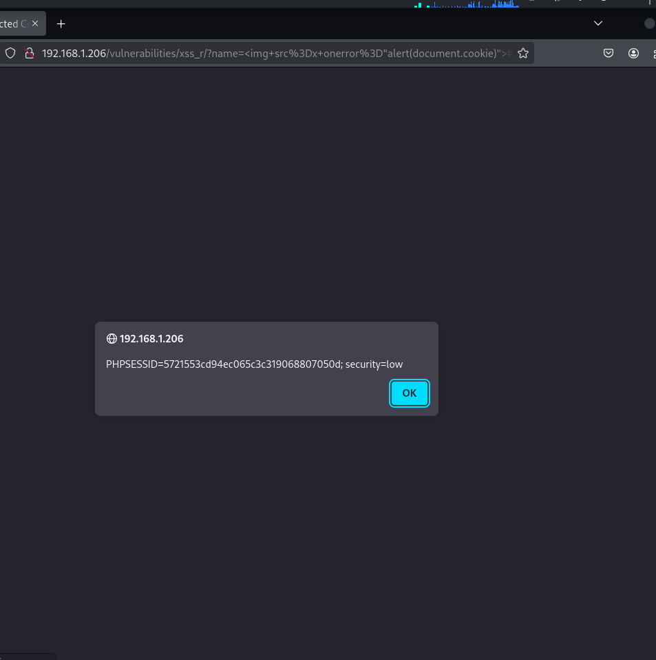

**LOW-MEDIUM-HIGH**

En el formulario existe un campo de texto que se refleja en la página, en todos los niveles de seguridad.

Usando el payload -->  se carga una imagen que al fallar la carga ejecuta un script.

### Nivel LOW - Medio - Alto

