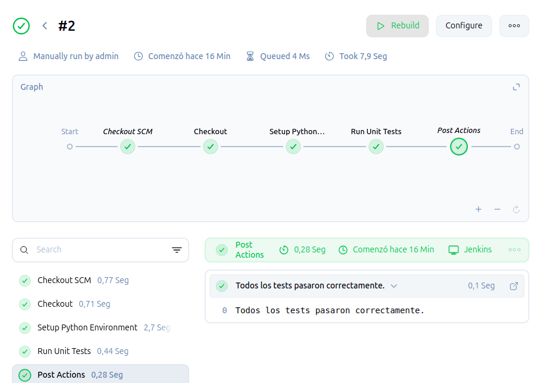

La pipeline en Jenkins se configura como Script de SCM.

El repositorio es: https://github.com/migvivcam/calculadora

La rama es: main

El Script Path es Jenskinsfile.

El proceso:
	
	Stage --> Setup Python Enviroment
	
	Se crea un entorno de python independiente para instalar los paquetes necesarios

	Stage --> Run Unit Tests 

		Se lanzan los tests unitarios del codigo

	Post --> Failure / Success

		Se devuelve información sobre la ejecución de la pipeline.

