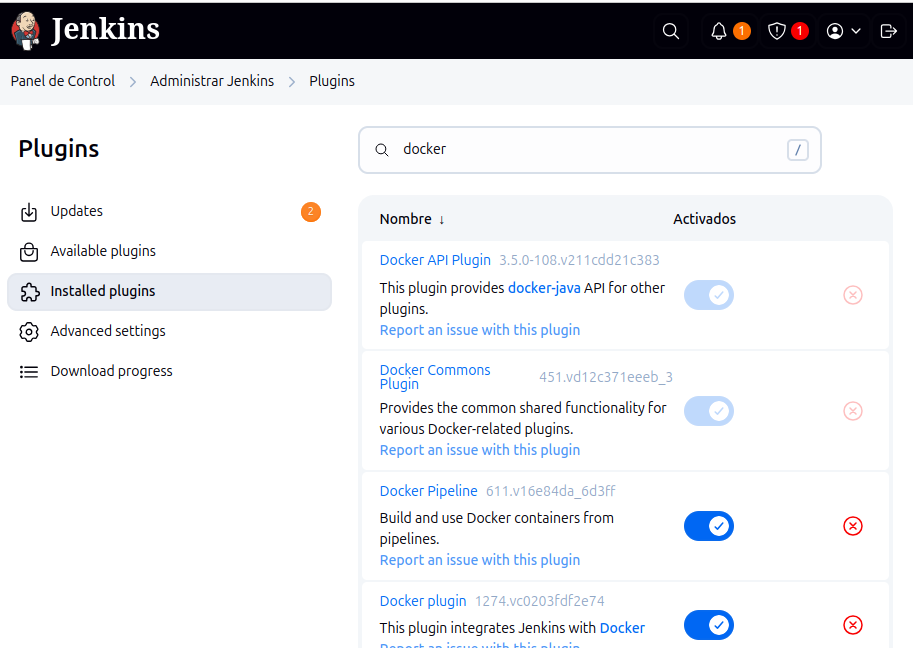
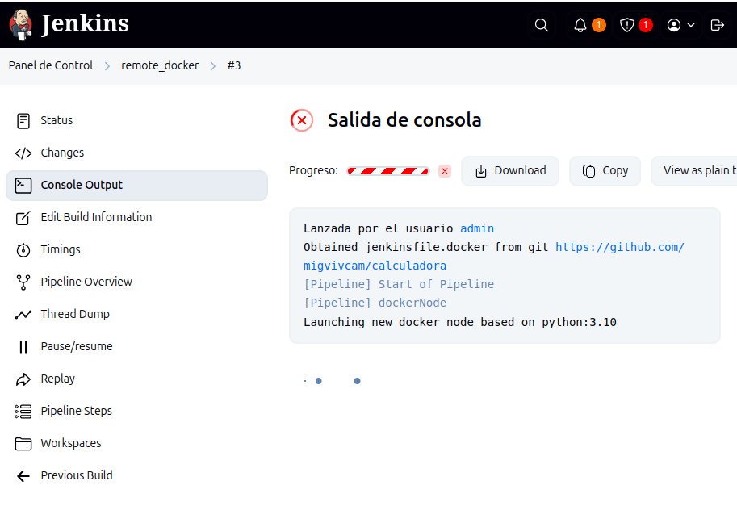

La pipeline en Jenkins se configura como Script de SCM.

El repositorio es: https://github.com/migvivcam/calculadora

La rama es: main

El Script Path es jenskinsfile.docker.

Para poder ejecutar la pipeline usando docker se han de instalar los plugins de docker en Jenkins.

El archivo jenskinsfile.docker usando los plugins de docker crea un nodo contenedor a partir del dockerfile y ejecuta los test en este.

