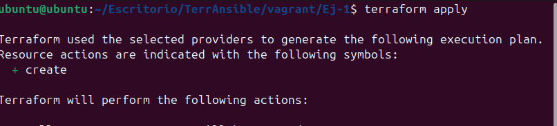

# 📦 VM con Terraform, Vagrant y Ansible

## 🛠️ Requisitos

Software utilizado:

- [Terraform](https://www.terraform.io/downloads)
- [Vagrant](https://www.vagrantup.com/downloads)
- [VirtualBox](https://www.virtualbox.org/)
- [Ansible](https://docs.ansible.com/ansible/latest/installation_guide/)

## 📁 Estructura del Proyecto

```
.
├── Ej-1					# Configuración principal de Terraform
├── Ej-2					# Configuración de la VM mediante Ansible
├── Ej-3					# Configuración del servidor Apache mediante Ansible
└── README.md		# Este archivo
```

## 🚀 Cómo usar este proyecto

**Clona el repositorio**

   ```bash
   git clone https://github.com/migvivcam/PPS-10197785
   cd PPS-10197785/RA5/RA5_2/Ej-1
   ```

### Ej-1. Provisionar una máquina virtual Ubuntu 24.04

El directorio Ej-1 contiene los archivos necesarios para levantar la máquina virtual, haciendo uso del provioneer "Vagrant".

La distribución de Ubuntu-24.04 utilizada ha sido creada por Progress Chef usando Bento.

Los pasos a seguir son:

1. **Iniciar e instalar dependencias**
   ```bash
   terraform init
   ```

2. **Revisar el plan**

   ```bash
   terraform plan
   ```

3. **Aplica la configuración**

   ```bash
   terraform apply
   ```



### Ej-2 Configuración de la VM con Ansible

El directorio Ej-2 contiene los archivos necesarios para configuar la VM usando Ansible.

1. **Explicación de hosts.ini**

Un archivo de inventario `hosts.ini` con el siguiente contenido:

```ini
[Ubuntu-Vagrant]
192.168.56.10 ansible_user=vagrant ansible_private_key_file=../Ej-1/.vagrant/machines/default/virtualbox/private_key ansible_ssh_common_args='-o StrictHostKeyChecking=no'
```
Con la ip configurada mediante terraform para la VM, el usuario y el certificado usado por vagrant para conectarse a la VM.

2. **Explicación de playbook.yml**

```yaml
- name: Configurar Ubuntu 24.04 - VM
  hosts: Ubuntu-Vagrant
  become: yes
  tasks:
    - name: Update & Upgrade
      apt:
        update_cache: yes
        upgrade: dist

    - name: Instalar Apache
      apt:
        name: apache2
        state: present
```

El cual se encarga de actualizar la VM e instalar Apache en esta.

3. **Ejecución**

No es necesario moverse entre los directorios.

```bash
ansible-playbook -i ../Ej-2/hosts.ini ../Ej-2/playbook.yml
```


### Ej-3 Configuración de Apache con Ansible

El directorio Ej-2 contiene los archivos necesarios para configuar la VM usando Ansible.

1. **Explicación de hosts.ini**
Un archivo de inventario `hosts.ini` con el siguiente contenido:

```ini
[Ubuntu-Vagrant]
192.168.56.10 ansible_user=vagrant ansible_private_key_file=../Ej-1/.vagrant/machines/default/virtualbox/private_key ansible_ssh_common_args='-o StrictHostKeyChecking=no'
```
La misma que en ejercicio Ej-2.

2. **Explicación de playbook.yml**

```yaml
- name: Configurar servidor web en Ubuntu 24.04 - VM
  hosts: Ubuntu-Vagrant
  become: yes
  tasks:
    - name: Instalar Apache
      apt:
        name: apache2
        state: present
        update_cache: yes

    - name: Crear index.html con mensaje personalizado
      copy:
        dest: /var/www/html/index.html
        content: "Ansible rocks"

    - name: Reiniciar el servicio Apache
      service:
        name: apache2
        state: restarted

    - name: Verificar el contenido usando curl
      command: curl http://localhost
      register: resultado

    - debug:
        var: resultado.stdout

```

El cual se encarga de comprobar que Apache esté instalado en el sistema, crear un texto en el direcorio Web de Apache y comprobar que se ha realizado correctamente.

3. **Ejecución**

No es necesario moverse entre los directorios.

```bash
ansible-playbook -i ../Ej-3/hosts.ini ../Ej-3/playbook.yml
```


## 📝 Notas

- Vagrant se encarga de provisionar la máquina virtual.
- Ansible se usa para configurarla automáticamente con herramientas o configuraciones específicas.
