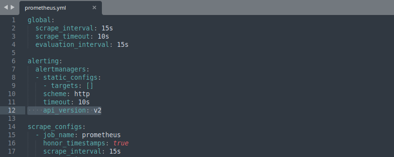
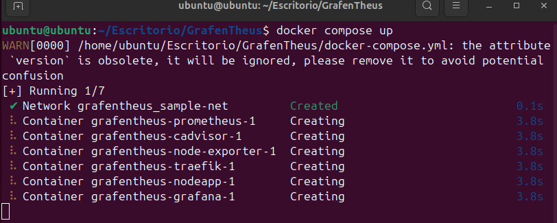
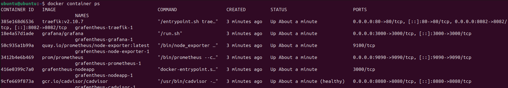
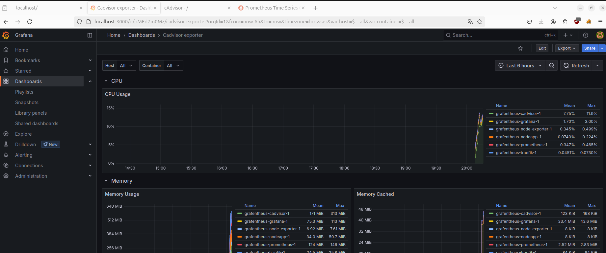
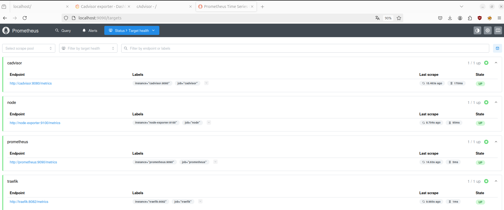
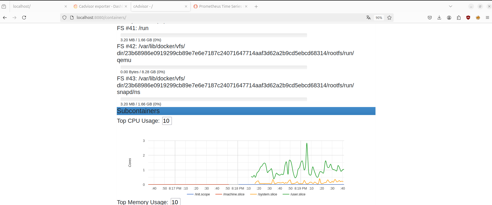

# 📊 Stack de Monitorización con Prometheus y Grafana

Este repositorio despliega un entorno de monitorización usando **Prometheus** y **Grafana** mediante Docker Compose. Prometheus recolecta métricas de un servicio de ejemplo y Grafana las visualiza en un dashboard.

## 🧰 Requisitos

- Docker
- Docker Compose
- Git

## 📥 Clonación del repositorio

```bash
git clone https://github.com/dinesh24murali/example_repo.git
cd example_repo/prometheus_grafana_example
```

Cambia la versión de la api de prometheus.



## 🚀 Puesta en marcha

1. Construir y levantar los contenedores:

```bash
docker compose up
```



2. Verificar que los contenedores están corriendo:

```bash
docker ps
```



Deberías ver al menos los siguientes servicios:
- `prometheus`
- `grafana`
- `sample_app`

## 🔍 Validación del funcionamiento

### 1. Acceso a Grafana

- URL: [http://localhost:3000](http://localhost:3000)
- Usuario por defecto: `admin`
- Contraseña por defecto: `grafana`

Una vez dentro:
- Verifica que exista una **Data Source** configurada apuntando a Prometheus (`http://prometheus:9090`).
- Carga el dashboard incluido o crea uno nuevo usando la fuente de datos Prometheus.



### 2. Acceso a Prometheus

- URL: [http://localhost:9090](http://localhost:9090)

Usa la barra de búsqueda para consultar métricas, por ejemplo:

```promql
http_server_requests_total
```



Deberías ver métricas generadas por el servicio de ejemplo (`sample_app`).

### 3. Probar la app de ejemplo

El contenedor `sample_app` expone un endpoint con métricas en:

```
http://localhost:8080/metrics
```



Puedes comprobarlo en el navegador o con `curl`:

```bash
curl http://localhost:8080/metrics
```

Deberías obtener una respuesta en formato Prometheus con métricas como:

```
# HELP http_server_requests_total Total number of HTTP requests
# TYPE http_server_requests_total counter
http_server_requests_total{method="GET",path="/"} 1
```

## 🧼 Apagar los servicios

```bash
docker-compose down
```

---

## 📎 Recursos adicionales

- [Documentación de Prometheus](https://prometheus.io/docs/introduction/overview/)
- [Documentación de Grafana](https://grafana.com/docs/)

---

## 🛠 Autor

Repositorio original creado por [Dinesh Murali](https://github.com/dinesh24murali)
