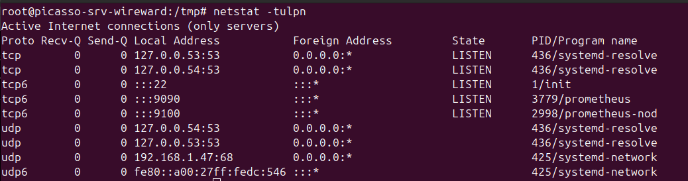
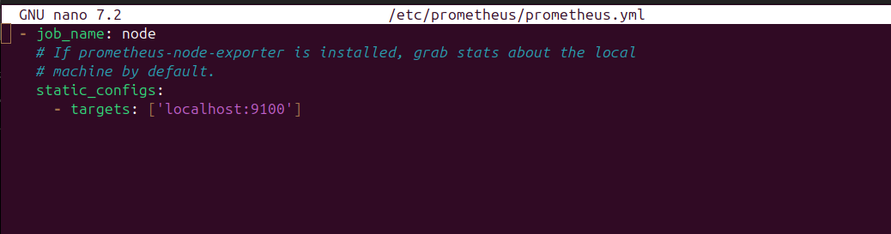
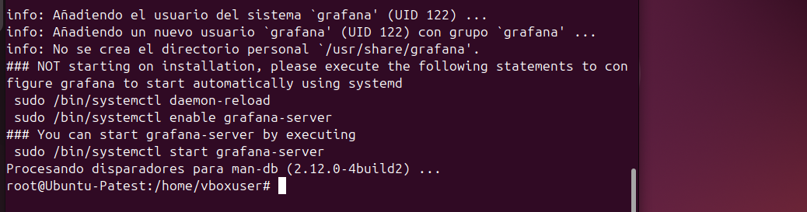
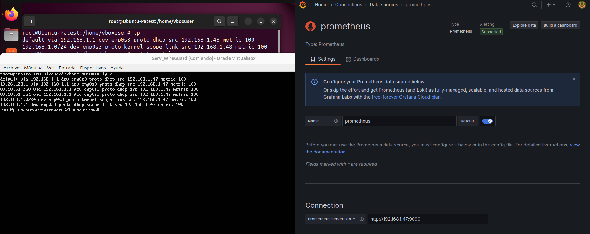
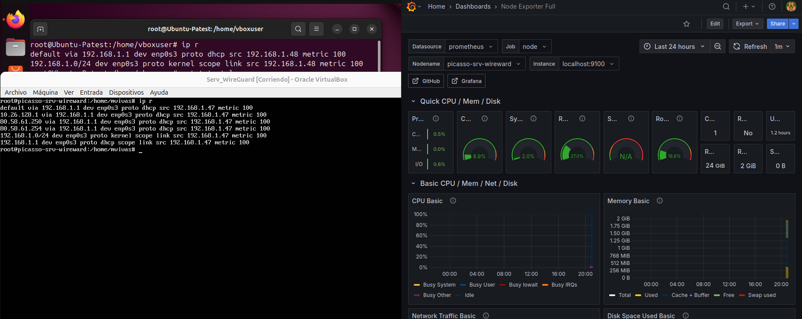

# 🛠️ Tarea 3.2 - Stack de Monitorización de Infraestructura con Prometheus y Grafana

Esta guía describe cómo desplegar un stack de monitorización en dos servidores Ubuntu separados:

- 🖥️ **Ubuntu Server** (máquina 1): Instalación de **Prometheus** y **Node Exporter**
- 📊 **Ubuntu 24.10** (máquina 2): Instalación de **Grafana** y configuración del **Dashboard de Node Exporter**

---

## 🧰 Requisitos Previos

- Dos máquinas corriendo Ubuntu Server (una puede ser Ubuntu 24.10)
- Conectividad de red entre ambas
- Acceso `root` o privilegios `sudo` en ambos sistemas

---

## 🔧 Paso 1: Instalar Prometheus y Node Exporter en Ubuntu Server (máquina 1)

### 1.1 Instalar Prometheus y Node Exporter

```bash
sudo apt update
sudo apt install -y prometheus
```

Esto instalará:
- Prometheus escuchando en el puerto `9090`
- Node Exporter escuchando en el puerto `9100`

Los servicios se activan automáticamente después de la instalación. Puedes verificarlo con:

```bash
sudo systemctl status prometheus
sudo systemctl status prometheus-node-exporter
```



### 1.2 Verificar configuración de Prometheus

Asegúrate de que el archivo `/etc/prometheus/prometheus.yml` tenga una sección para Node Exporter como esta:

```yaml
scrape_configs:
  - job_name: 'node_exporter'
    static_configs:
      - targets: ['localhost:9100']
```



---

## 📈 Paso 2: Instalar Grafana en Ubuntu 24.10 (máquina 2)

### 2.1 Añadir repositorio e instalar

```bash
sudo apt install -y software-properties-common
sudo add-apt-repository "deb https://packages.grafana.com/oss/deb stable main"
wget -q -O - https://packages.grafana.com/gpg.key | sudo apt-key add -
sudo apt update
sudo apt install grafana
```



### 2.2 Iniciar y habilitar el servicio

```bash
sudo systemctl enable grafana-server
sudo systemctl start grafana-server
```

Accede en tu navegador: [http://<IP_MAQUINA_2>:3000](http://<IP_MAQUINA_2>:3000)


---

## 🧩 Paso 3: Configurar Grafana con Prometheus como fuente de datos

1. Inicia sesión en Grafana
2. Ve a **Configuration → Data Sources**
3. Añade nueva fuente de tipo **Prometheus**
4. URL: `http://<IP_MAQUINA_1>:9090`
5. Guarda y prueba



---

## 📊 Paso 4: Añadir Dashboard de Node Exporter

1. Ir a **Dashboards → Import**
2. Usar el ID del Dashboard oficial de Node Exporter: `1860`
3. Seleccionar Prometheus como fuente de datos
4. Guardar y visualizar

---

## ✅ Validación

- Accede a Prometheus: [http://<IP_MAQUINA_1>:9090](http://<IP_MAQUINA_1>:9090)
- Accede a Grafana: [http://<IP_MAQUINA_2>:3000](http://<IP_MAQUINA_2>:3000)
- Verifica que el dashboard de Node Exporter muestre métricas del sistema



---

## 🧼 Parar los servicios (si es necesario)

```bash
sudo systemctl stop prometheus prometheus-node-exporter grafana-server
```

---

## 📎 Recursos útiles

- [Prometheus](https://prometheus.io/)
- [Node Exporter](https://github.com/prometheus/node_exporter)
- [Grafana](https://grafana.com/)

