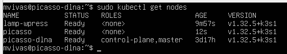
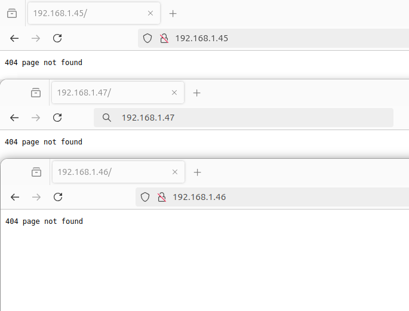
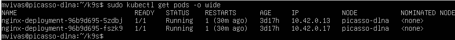
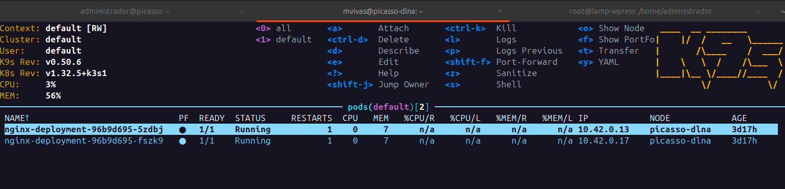

# Actividad 5.2 - Instalación y despliegue en K3s (HA) con K9s

## Objetivo

Instalar, configurar y validar un clúster K3s en modo **alta disponibilidad (HA)** utilizando múltiples nodos, desplegar un servicio **nginx** con 2 réplicas, y utilizar **K9s** para monitorización y validación.

---

## Requisitos previos

* Al menos 3 máquinas virtuales (o físicas) con Linux.
* Conectividad de red entre ellas.
* Acceso con permisos `sudo`.
* Firewall abierto en puertos 6443, 9345 y entre nodos para etcd (si aplica).

---

## Arquitectura HA en K3s

### Opciones de almacenamiento para alta disponibilidad:

1. **HA Interna (embedded etcd)**:

   * Desde K3s v1.19+.
   * Requiere 3 nodos "server" para quorum.
   * Menos dependencias externas.

2. **HA Externa (DB externa)**:

   * Requiere una base de datos externa como PostgreSQL, MySQL o etcd.
   * Mayor complejidad, pero más escalable.

En esta actividad se usará **embedded etcd** (HA interna).

---

## Esquema de pasos

### 1. Instalación del primer nodo (server 1)

```bash
curl -sfL https://get.k3s.io | INSTALL_K3S_EXEC="--cluster-init" sh -
```

Verifica el estado:

```bash
sudo systemctl status k3s
```

Obtén el token:

```bash
sudo cat /var/lib/rancher/k3s/server/node-token
```

Obtén la IP del nodo:

```bash
ip a | grep inet
```

---

### 2. Instalación de nodos server 2 y server 3

En cada nodo:

```bash
curl -sfL https://get.k3s.io | K3S_URL=https://<IP-SERVER-1>:6443 K3S_TOKEN=<TOKEN> sh -
```

Reemplaza `<IP-SERVER-1>` y `<TOKEN>` con los valores del primer nodo.

Verifica:

```bash
sudo k3s kubectl get nodes
```



### 3. Alias para kubectl (opcional)

```bash
alias kubectl='k3s kubectl'
```

---

### 4. Despliegue de nginx con 2 réplicas

Crear `nginx-deployment.yaml`:

```yaml
apiVersion: apps/v1
kind: Deployment
metadata:
  name: nginx-deployment
spec:
  replicas: 2
  selector:
    matchLabels:
      app: nginx
  template:
    metadata:
      labels:
        app: nginx
    spec:
      containers:
      - name: nginx
        image: nginx:latest
        ports:
        - containerPort: 80
```

Aplicar el manifiesto:

```bash
kubectl apply -f nginx-deployment.yaml
```



Verificar:

```bash
kubectl get pods -o wide
```



---

### 5. Instalación y uso de K9s

Descargar y mover el binario:

```bash
curl -sSLo k9s.tar.gz https://github.com/derailed/k9s/releases/latest/download/k9s_Linux_amd64.tar.gz
tar -xvzf k9s.tar.gz
sudo mv k9s /usr/local/bin/
```

Ejecutar:

```bash
k9s
```


